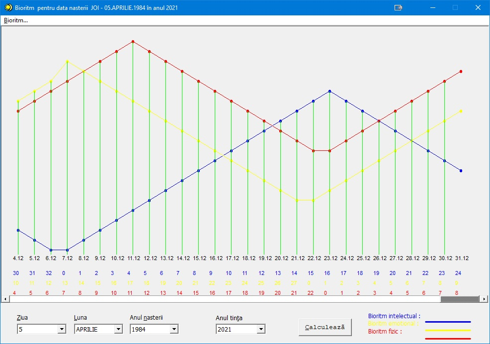

# biorithm

My first real program written with VB6 and Win32 API in 2001.

It's about calculating the biorithm - yeah, I know, I was into these things back then - with the Intelectual (blue), Emotional (yellow) and Physical (red) cycles.
The .exe still runs today on Windows 10.

The settings read:

Day - Month - Year -> Target year -> Calculate

